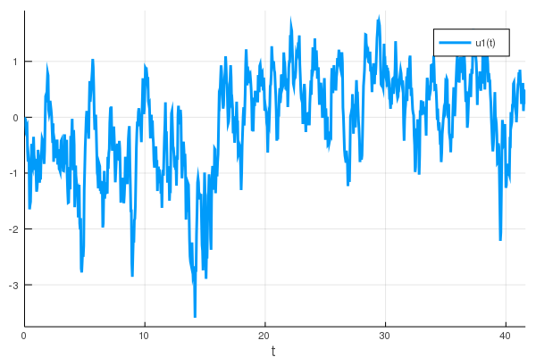

# Examples

## Create an SGS distribution

One may create an SGS distribution by fitting the distribution to known statistics by the method of moments. For example, to create an SGS distribution with mean zero, a variance and skewness of 1 and a kurtosis of 5, issue:

```julia
julia> using SGSDist

julia> d = fit(SGS, 1, 1, 5)
SGS{Float64}(E=0.6236095644623235, b=1.1709106481844573, g=0.48997894350611143)
```

Here, `d` is an SGS distribution that has been fitted to the moments specified with parameters `E`, `g` and `b`.

By loading the `Plots.jl` package, one can plot this SGS pdf:

```julia
julia> using Plots

julia> x = collect(-6:0.01:6)
1201-element Array{Float64,1}:
 -6.0
 -5.99
 -5.98
 -5.97
 -5.96
 -5.95
 -5.94
  ⋮   
  5.94
  5.95
  5.96
  5.97
  5.98
  5.99
  6.0

julia> plot(x, pdf.(d, x))

```


## Fit an SGS distribution from data

An SGS distribution may be also be fit from climate data. For example, one may create an SGS distribution by fitting the sample reanalysis time series provided by the function [`air()`](@ref):

```julia
julia> air()
6408-element Array{Float64,1}:
  0.67547214
  0.8308915  
  0.19012427
 -0.20711477
 -0.10181273
  0.7421673  
  0.22026125
  ⋮          
  0.3421846  
  0.044188347
  0.2433472  
  0.4460243  
  1.4941149  
  0.49388295
 -0.052520715

julia> d = fit(SGS, air())
SGS{Float64}(E=0.36623331624359673, b=0.7133796999284913, g=-1.1648873051087967)

julia> plot(x, pdf.(d, x))

julia> using StatsPlots

julia> hist!(x)

```


## Markov processes

### Correlated and additive multiplicative (CAM) noise model

One may create a time series via Markov process that represents the statistics of a given SGS distribution. First, specify the SGS distribution -- here we create an SGS distribution with variance and skewness of 1 and (excess) kurtosis of 5.

```julia
julia> d = fit(SGS, 1, 1, 5)
SGS{Float64}(E=0.6236095644623235, b=1.1709106481844573, g=0.48997894350611143)
```

We can produce a time series using the `CAM1D()` function, which corresponds to the one-dimensional correlated additive and multiplicative (CAM) noise model described in Sardeshmukh and Sura (2009). The CAM noise model is able to reproduce non-Gaussian statistics that are seen in climate observations of daily atmospheric variables.

```julia
julia> n = 1000  # length of time series
1000

julia> sol = CAM1D(d, n)
retcode: Success
Interpolation: 1st order linear
t: 1001-element Array{Float64,1}:
  0.0                 
  0.041666666666666664
  0.08333333333333333
  0.125               
  0.16666666666666666
  ⋮                   
 41.49999999999982    
 41.54166666666649    
 41.58333333333315    
 41.624999999999815   
 41.625               
u: 1001-element Array{Array{Float64,1},1}:
 [0.0]      
 [0.122174]
 [0.313727]
 [0.477212]
 [1.04692]  
 ⋮          
 [-0.636782]
 [-0.309111]
 [-0.154719]
 [-0.290622]
 [-0.290621]

julia> plot(sol)

```



One may also change the time step, `dt`, as well as the damping term, `λ`. Moreover, a seed may be specified in order to reproduce a time series over subsequent runs.

```julia
julia> sol = CAM1D(d, n, dt=1/12, λ=0.5, seed=42)
retcode: Success
Interpolation: 1st order linear
t: 1001-element Array{Float64,1}:
  0.0                
  0.08333333333333333
  0.16666666666666666
  0.25               
  0.3333333333333333
  0.41666666666666663
  0.49999999999999994
  ⋮                  
 82.83333333333299   
 82.91666666666632   
 82.99999999999964   
 83.08333333333297   
 83.1666666666663    
 83.24999999999963   
 83.25               
u: 1001-element Array{Array{Float64,1},1}:
 [0.0]                 
 [-0.05538507236046933]
 [0.3759078513765658]  
 [0.31482891888314435]
 [0.2586995978771357]  
 [0.006314400534034209]
 [0.0819076515551696]  
 ⋮                     
 [0.6914165604620272]  
 [1.2048828846162347]  
 [0.6995798768325541]  
 [0.541755324779944]   
 [0.5939196502928672]  
 [0.6785936302181322]  
 [0.6785940957553153]  

julia> plot(sol)

```


### Hasselmann's model

It is also possible to create a Markov process time series using the Hasselmann (1976) climate model, described in:

> Hasselmann, K., 1976: Stochastic climate models Part I. Theory. *Tellus*, **28**, 473–485, [https://doi.org/10.1111/j.2153-3490.1976.tb00696.x](https://doi.org/10.1111/j.2153-3490.1976.tb00696.x).

The Hasselmann Markov process -- which is an AR(1) process -- produces a time series that is normally distributed.

```julia
julia> n = 1000  # length of time series
1000

julia> sol = Hasselmann1D(n)
retcode: Success
Interpolation: 1st order linear
t: 1001-element Array{Float64,1}:
  0.0                 
  0.041666666666666664
  0.08333333333333333
  0.125               
  0.16666666666666666
  0.20833333333333331
  0.24999999999999997
  ⋮                   
 41.416666666666494   
 41.45833333333316    
 41.49999999999982    
 41.54166666666649    
 41.58333333333315    
 41.624999999999815   
 41.625               
u: 1001-element Array{Array{Float64,1},1}:
 [0.0]                
 [0.02634147381570931]
 [0.06909671634959474]
 [0.311743726899033]  
 [0.5943736799301251]
 [0.4215357023451997]
 [0.2506514745054867]
 ⋮                    
 [-0.7733132505027923]
 [-0.8065075584943057]
 [-0.762325615339476]
 [-0.9280604718015151]
 [-1.2373636151238154]
 [-1.243929957136598]
 [-1.2439305063701647]

julia> plot(sol)
```


Again one may specify the time step, damping terms and the seed used for the random number generation.

```julia
julia> sol = Hasselmann1D(n, dt=1/12, λ=0.5, seed=42)
retcode: Success
Interpolation: 1st order linear
t: 1001-element Array{Float64,1}:
  0.0                
  0.08333333333333333
  0.16666666666666666
  0.25               
  0.3333333333333333
  0.41666666666666663
  0.49999999999999994
  ⋮                  
 82.83333333333299   
 82.91666666666632   
 82.99999999999964   
 83.08333333333297   
 83.1666666666663    
 83.24999999999963   
 83.25               
u: 1001-element Array{Array{Float64,1},1}:
 [0.0]                 
 [-0.13005535542166105]
 [0.04828669603525988]
 [0.6586911660509708]  
 [0.47664314043490363]
 [0.2527905702593072]  
 [0.5063085613562421]  
 ⋮                     
 [-0.470018895671266]  
 [-0.6640224731670596]
 [-0.6412697125734017]
 [-0.8226707386234937]
 [-0.9240097641730842]
 [-0.3550868399241891]
 [-0.3550865369728031]

julia> plot(sol)

```


## Random number generation

Produce a random number or an array of random numbers drawn from the SGS distribution `d` by invoking `rand()`.

```julia
julia> rand(d)
-0.6568019443675626

julia> rand(d, 10)
10-element Array{Float64,1}:
 -0.6658576564565255
 -0.182584214456065  
 -0.3849235898350698
 -1.8058720924121987
  0.08814146377788976
  0.4741505815188713
  0.20989773773209539
  0.37743678587708196
 -0.19880370169821895
  1.0225965534875916
```
